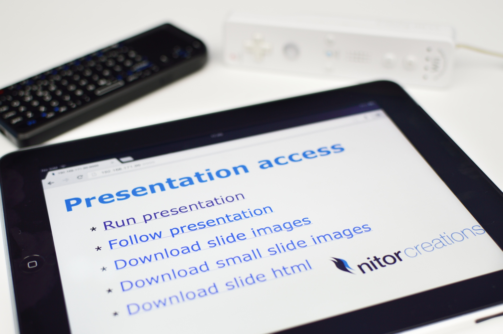

# Developer Oriented Presentation Engine #



This repository contains a presentation engine that is meant to run on the Raspberry Pi and a sample
presentation with a reasonable amount of slides. The general idea is that you can write your presentation
with [Markdown](https://github.com/adam-p/markdown-here/wiki/Markdown-Cheatsheet) and then build that into
a zip file that you can then run on any platform that runs JavaFX. [Here](https://www.youtube.com/watch?v=1sdZpecv9a8)
is an introductory video on how it works.

## Features ##

All of the source of the slides in the presentation are markdown. If you run out of markdown features, you can just
put in html.

The presentation can be controlled with a keyboard, a Nintendo Wii controller or a browser:

* Up key, Wiimote direction button up or the gesture "up": Fast transition forward
    * Just rotate to the rotation of the target slide and move it into place
    * First transition is always slow - slides dropping and spreading out
    * Transition to a slide with video is also always the longer one
* Right key, Wiimote direction button right or the gesture "right": Slow transition forward
    * Zoom out and rotate to original orientation, move to on top of the next slide and then zoom in and rotate for the target slide
* Down key, Wiimote direction button down or the gesture "down": Fast transition backward
* Left key, Wiimote direction button left or the gesture "left": Slow transition backward
* Key A, Wiimote button '-' or the gesture "clockwise circle": Slow transition to the first slide
* Key E, Wiimote button '2' or the gesture "counter clockwise circle": Slow transition to the last slide
* Wiimote button 'A': draw highlight where the Wiimote Infrared mouse is pointing
* Wiimote button 'B': try to recognize gesture

The video integration is a bit tricky since Java 8 JavaFX that is running on the raspberry pi can't
run it out of the box. What happens is that the build script records the position of the video placeholder image
and at runtime the presentation extracts the video into a temporary file. Then when you navigate away from the the slide
it zooms in on the placeholder and runs ```videoplayer {temporaryfile}```. 
On my Raspberry Pi this script is in ```/usr/bin/videoplayer```:

```
#!/bin/bash

exec /usr/bin/omxplayer "$@"
```

And on my Ubuntu desktop this is ```/usr/bin/videoplayer```:

```
#!/bin/bash

exec /usr/bin/mplayer -noidle -fs "$@"
```

Unfortunately on the Raspberry Pi there is currently no way of controlling the playback.

## Running ##

On the raspberry Pi this requires using the smaller images to fit into memory:

```
java -Dslides=slides-small -jar jfx-presentation-shanghai-1.0-jfx.jar
```

If you don't want to use the Wiimote:

```
java -Dslides=slides-small -Dnowiimote=true -jar jfx-presentation-shanghai-1.0-jfx.jar
```

Running the http server requires specifying a port and on the Raspberry Pi you don't want to
cache all the contents in memory. You also probably want to specify a password for context that
controls the presentation:

```
java -Dslides=slides-small -Dhttpport=9999 -Dhttprunpasswords=.passwords -Dnocache=true -jar jfx-presentation-shanghai-1.0-jfx.jar
```


## Using ##

For now the easiest way of using this is to fork this repo, create your own css and background and write your own
markdown slides. The transitions aren't that complex so even those are potential targets for change.

The relative directory for referring to stuff from html is ```src/main/resources/html``` so that is where your images
and videos go.

After that you just build your jar as described below and run it as described above.

## Gestures ##

The gesture definitions are in ```src/main/resources/gestureset```. If you would like to make your own, you
can record them with the [Wiigee Demo GUI](http://www.wiigee.org/download/download.html), put them in that
directory and add them to the Java code. They need to be added to the loading in ```initWiimote()``` and
then the event processing needs to be added to ```gestureReceived(GestureEvent event)```. Both are in ```PresentationController```
class.

## HTTP server ##

You can start a http server that serves the slides by adding ```-Dhttpport={port}```. Navigating to the root of that
server will then give you the default index page with links to the contexts.

There are four contexts for the http server. 
 * ```default``` shows the default index page. The default served page is ```src/main/resources/index-default.html```
     * Also the presentation pdf if served from this context by default
 * ```run``` allows running the on-screen presentation from a browser
 * ```follow``` allows following the presentation in a browser
 * ```download``` allows downloading the presentation in a couple of formats contained in a single zip file.

Each can have set passwords by defining ```-Dhttp{context}passwords={password.properties}``` where password.properties is just
a property file with ```username=password``` entries. The authentication method used is digest authentication so sniffing the
run password in an open WLAN is not trivial. The presentation already stretches the capabilities of the Raspberry Pi so I didn't
want to push it by using SSL. For most situations I think that would be overkill.

	
## Building ##

The build works on my Ubuntu workstation and my Ubuntu jenkins server, but it should work on any computer with [Maven 3.0.5](http://maven.apache.org).

The bulk of the work is handled with the [dope-maven-plugin](https://github.com/NitorCreations/dope-maven-plugin). It uses the following libraries for the job:
 * [pegdown](https://github.com/sirthias/pegdown) to transform the markdown to html
 * [embeddedphantomjs](https://github.com/Jarlakxen/embedphantomjs) to render png images and pdf documents from the html
 * [imgscalr](http://www.thebuzzmedia.com/software/imgscalr-java-image-scaling-library/) for creating the smaller images from the FullHD ones and
 * [velocity](http://velocity.apache.org/) to create the index pages from templates
 * [pdfbox](http://pdfbox.apache.org/) to merge the single slide pdf documents in to the full presentation document
 * [pygments](http://pygments.org/) for syntax highlighting inline code blocks of practically [any language](http://pygments.org/languages/)

For the JavaFX tooling in this it uses [javafx-maven-plugin](http://zenjava.com/javafx/maven/) The ```jar``` goal in the JavaFX maven plugin and an 
assembly that creates a zip with the JavaFX jar plus dependencies are bound to ```package``` and ```pre-integration-test``` phases respectively, so 
creating a zip with everything is just:

```
mvn clean install
```

The resulting javafx binaries will be under ```target/jfx/app```. Dependencies will go into the ```lib``` subdirectory -
all of them need to be included when running and they are packaged in the resulting zip file.


## Acknowledgements ##

The Wiimote integration is thanks to [Wiigee project](http://www.wiigee.org/) and underneath that I rely on the java
bluetooth stack by [Bluecove](http://bluecove.org/). Wiigee isn't in Maven central and bluecove 2.1.0 at least doesn't
include the JNI bits for arm, so I published both of those in a [github maven repository](https://github.com/NitorCreations/maven-repository).


